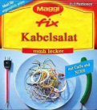

# Kabelsalat

*Kabelsalat* ist ein Tool zur Erzeugung von Fertigungsdaten für Draht- und Kabelsätze
in der Elektro- und Schaltschrankbau. Hierzu verbindet das Programm Daten aus den Verdrahtungslisten
gängiger ECAD-Systeme mit Informationen zur Aderendbehandlung aus einer eigenen Datensammlung.

Die Idee hierbei ist, auch ohne kompliziertem, zeitaufwendigem und daher teuren 3D-Design gültige
Fertigungsdaten für eine automatisierte Fertigung zu erhalten. Zudem muss nicht zwingend der komplette
Aufwand der technischen Spezifikation im Konstruktionsbüro verbleiben. Hierdurch können auch die
Arbeitsvorbereitungen und Koordinierungsstellen der Produktion ihr Fachwissen und ihre Arbeitskraft
wieder entsprechend einbringen.

 > **HINWEIS:** Diese Version ist nicht mehr kompatibel zum Phoenix Contact wire Assist in der Version 1.0.
 > Zur aktuellen Version 1.2 wurden grundlegende Änderungen des Datenformats gemacht, so daß die Daten nicht zwischen
 > den beiden Version austauschbar sind.

# Copyright und Lizenz

**Copyright (c) 2022 ALX-Development**

Permission is hereby granted, free of charge, to any person obtaining a copy
of this software and associated documentation files (the "Software"), to deal
in the Software without restriction, including without limitation the rights
to use, copy, modify, merge, publish, distribute, sublicense, and/or sell
copies of the Software, and to permit persons to whom the Software is
furnished to do so, subject to the following conditions:

The above copyright notice and this permission notice shall be included in all
copies or substantial portions of the Software.

THE SOFTWARE IS PROVIDED "AS IS", WITHOUT WARRANTY OF ANY KIND, EXPRESS OR
IMPLIED, INCLUDING BUT NOT LIMITED TO THE WARRANTIES OF MERCHANTABILITY,
FITNESS FOR A PARTICULAR PURPOSE AND NONINFRINGEMENT. IN NO EVENT SHALL THE
AUTHORS OR COPYRIGHT HOLDERS BE LIABLE FOR ANY CLAIM, DAMAGES OR OTHER
LIABILITY, WHETHER IN AN ACTION OF CONTRACT, TORT OR OTHERWISE, ARISING FROM,
OUT OF OR IN CONNECTION WITH THE SOFTWARE OR THE USE OR OTHER DEALINGS IN THE
SOFTWARE.